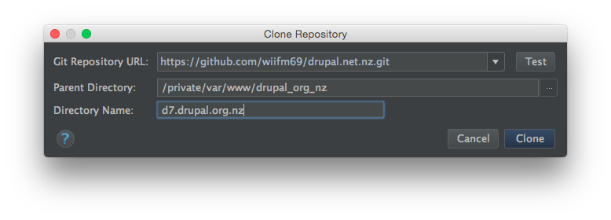
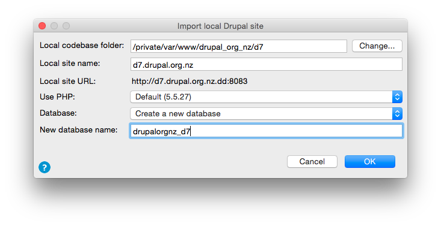

# drupal.org.nz

Support notes for team collaboration around the drupal.org.nz project.

## Contributing

You should:
* Sign up to or ask for an invite to [the Trello board](https://trello.com/b/EwBhCUb5/drupal-net-nz)
* Have an active account on live [https://drupal.org.nz/](https://drupal.org.nz/). Ping someone on trello if you need account promotion.
* Supply your public ssh key to someone on the team so we can install it onto the live server and grant you drush-level pull access from live.

# About Live

## Details

Live D7 site-alias:  @drupal.org.nz

    <?php
    $aliases["drupal.org.nz"] = array (
      'root' => '/var/www/drupalnetnz/live.taranto',
      'uri' => 'drupal.org.nz',
      'remote-host' => 'taranto.coders.co.nz',
      'remote-user' => 'aegir',
      'path-aliases' => array (
        '%drush' => '/var/aegir/.composer/vendor/drush/drush',
        '%drush-script' => '/var/aegir/.composer/vendor/bin/drush',
        '%site' => 'sites/drupal.org.nz/',
        '%files' => 'sites/drupal.org.nz/files',
      ),
    );

In this document, the nominal localhost for development is named `d7.drupalorgnz.dd` .
 Replace this with your own preferred name as appropriate.

## Server

Hosting is on a semi-dedicated server called `taranto.coders.co.nz` .
(On DigitalOcean, Looked after by dman)

For most deployment tasks, ssh access as the `aegir` daemon user
on that box is sufficient, and can be shared with the team.

* Provide a team-member with your public ssh key.
* That can be installed into `taranto.coders.co.nz:/var/aegir/.ssh/authorized_keys` .
* Connect to the box one time to verify the connection.

      ssh aegir@taranto.coders.co.nz

* Once that is working, you can use the drush alias.
  * Copy or create `drupal.org.nz.alias.drushrc.php` with the site-alias details above into your ~/.drush folder (or similar location).
  * Test your connection to that site instance:

        drush -v  @drupal.org.nz status

## User

The Aegir (shared) user account on [the server](README.server.md)
 * May be shared among the team,
 * Can pull from our git repositories _but should not be used to commit back_
 * has access to drush,
 * owns all the web files
 * has ability to read apache logs and hup apache,
 * and is a mysql admin.

## Database

Live database connection details can be deduced/pulled from the drush alias
 automatically if needed.

The recommended way to pull a database snapshot is using `drush sql-sync` .

    drush sql-sync @drupal.org.nz @d7.drupalorgnz.dd

Alternatively, you can fetch an sql-dump through the web UI
[using backup_migrate](https://drupal.org.nz/admin/config/system/backup_migrate)
 when logged in to the live site.

The live database server does not offer an open port for direct MySQL connections.

### Aegir user access to database

You can hit the database using a locally memorized password - typing:

    mysql

should just work enough to give you lots of access.

However, If you wanted to connect directly:

    drush @drupal.org.nz sql-cli

Is best, and is equivalent to something like:

    mysql --user=drupalorgnz -p{dbconnectionpass} --host=taranto.coders.co.nz drupalorgnz_0

#### Reference: the setup steps used to build a site db manually

    aegir@taranto:~$ mysql
      mysql> create database drupalorgnz_sandbox;
      mysql> GRANT ALL PRIVILEGES ON drupalorgnz_sandbox.* to drupalorgnz@localhost IDENTIFIED BY '{dbconnectionpass}';

## Files

The recommended way to pull copies of the latest live user files is using `drush rsync` .

    drush rsync @drupal.org.nz:%files @d7.drupalorgnz.dd:%files

Alternatively, you can fetch the files through the web UI using backup_migrate
 when logged in to the live site.

Run that command with --debug option on to see the commands and paths being run
 if you would rather set up your own sftp mappings or syncs.

## Code / Git

The Drupal7 codebase is public, and available for pulling from

    https://github.com/wiifm69/drupal.net.nz.git
    git@github.com:wiifm69/drupal.net.nz.git

For write access, talk to Sean, or figure out pull requests.

This repo is *inherited* from drupal.org upstream, so it includes all d.o history.

It does not use any special branch policy, everything is on master.
Using local short-lived dev branches is recommended, but not enforced.

Contrib modules are added or upgraded via drush as tarballs,
 then committed directly via git.

Core upgrades are applied by re-attaching drupal.org as an upstream remote, then
 merging in the upstream changes.

# Local setup : HOWTO copy from live

The above details are all you need to get going.
An example quickstart from scratch could look like:

#### Clone the codebase from github

Use either your CLI or IDE

      /var/www/drupal_org_nz$ git clone git@github.com:wiifm69/drupal.net.nz.git d7

#### Initialize a new local server on that codebase (vhost+db)

I use Acquia dev desktop.

Alternative processes are up to you.

#### (Optional) initialize a local site-alias for the new site.

      cd d7/sites/d7.drupalorgnz.dd
      echo "<?php" > ~/.drush/d7.drupalorgnz.dd.alias.drushrc.php
      drush site-alias d7.drupalorgnz.dd >> ~/.drush/d7.drupalorgnz.dd.alias.drushrc.php

#### Downsync the live database and files

    drush sql-sync @drupal.org.nz @d7.drupalorgnz.dd
    drush @d7.drupalorgnz.dd cc all

(
You may have to mess around with filepaths slightly - up to you.
Either make the local filesystem resemble live,
 or variable_set the files paths in your settings.php
 to override them to reflect the local paths.
 *Personally* I most often use stage_file_proxy to handle this,
 but that is out-of-scope to explain
)

    mkdir sites/drupal.org.nz/files
    mkdir sites/drupal.org.nz/private
    mkdir sites/drupal.org.nz/private/temp
    mkdir sites/drupal.org.nz/private/files
    drush rsync -v @drupal.org.nz:%files @d7.drupalorgnz.dd:%files

We seem to have 89M of files uploaded to the site, so the downsync can take a while.
That seems excessive for the amount of content...

But at this point you shoild have a working clone of current live.

# Other sysadmin notes

See [README.server.md](README.server.md)

### SSL

The Apache server has a verified SSL certificate installed, and **live** will
bounce to https when possible.

## DNS

Is through http://1stdomains.nz/ (don't ask why).
It has a wildcard, to support additional subdomains for dev/test/preview,
(but these will not be able to use the same SSL cert)

    *.drupal.org.nz A 162.243.138.236

> Yes, there was some historical duplication with both drupal.net.nz
 and drupal.org.nz being different working titles at diffent times.
 2014+ :
  .net.nz (Managed by Bevan Rudge on behalf of the community)
  redirects to .org.nz  (Managed by Dan Morrison on behalf of the community)
